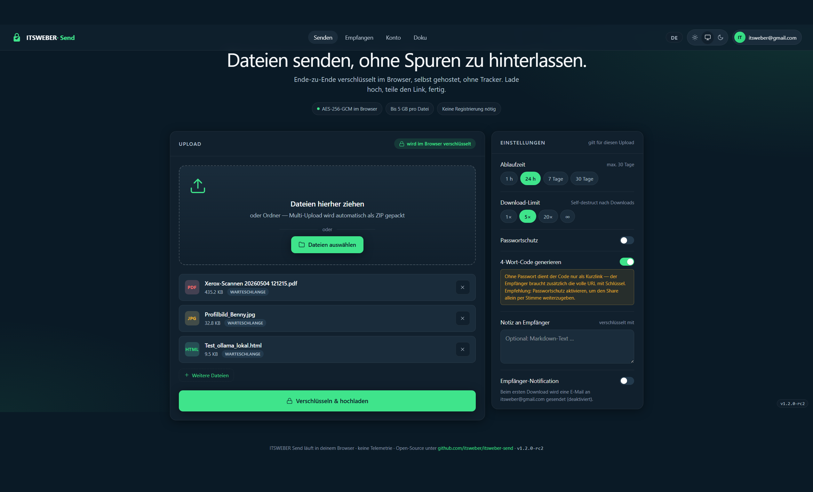
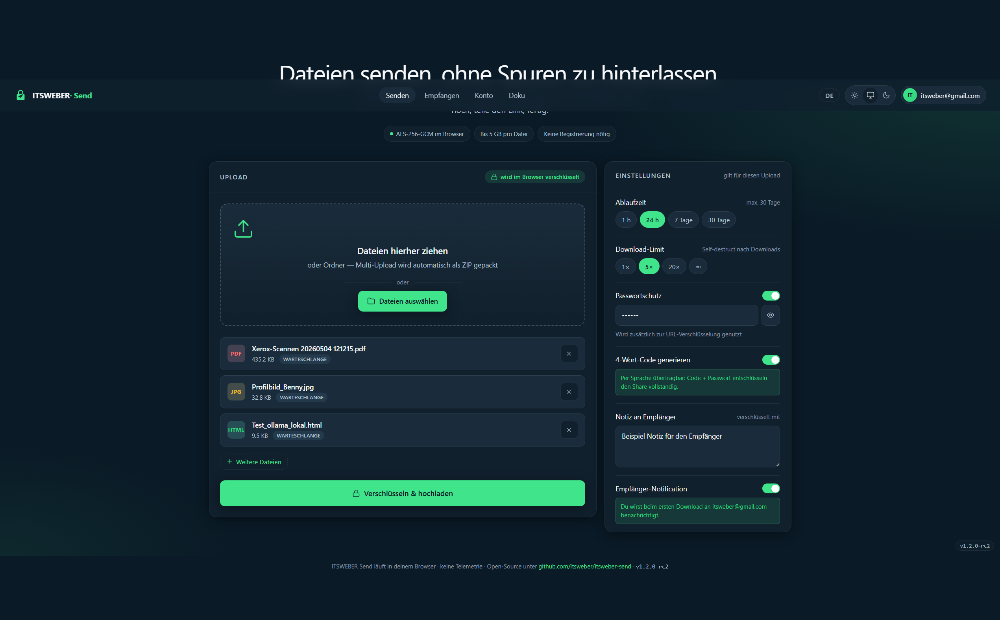
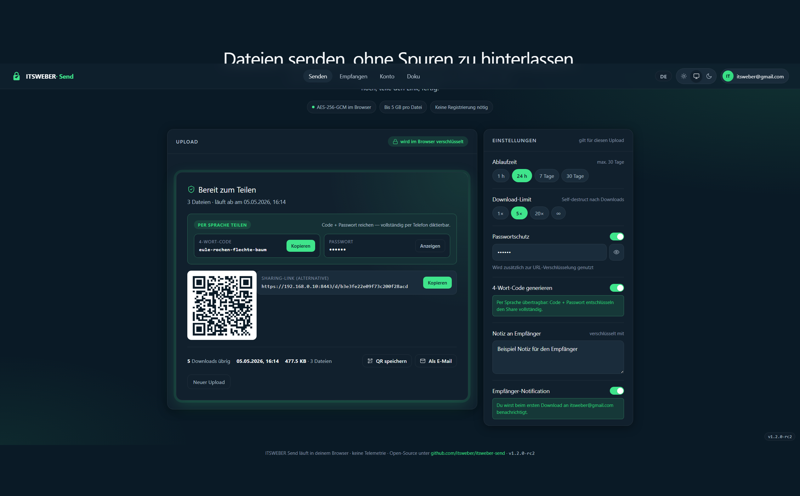
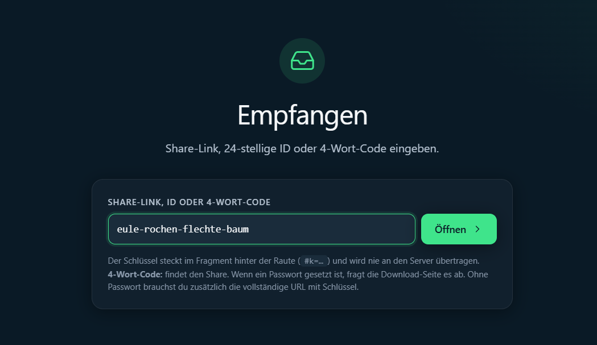
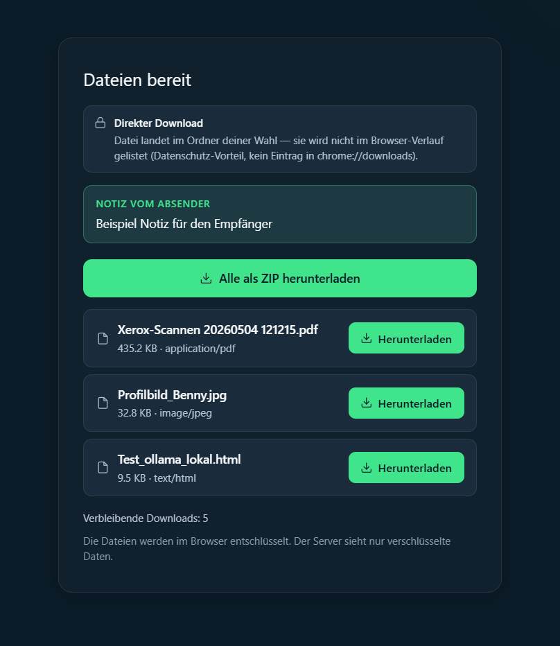
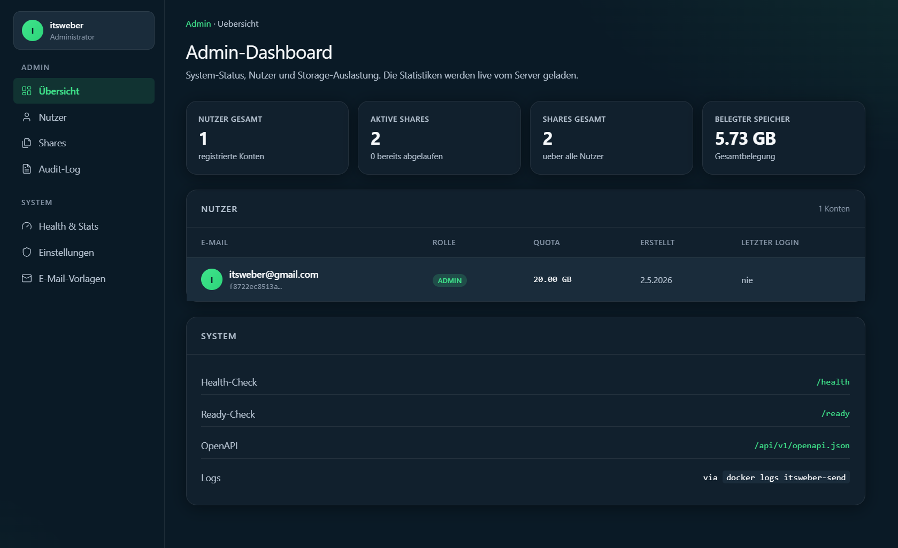
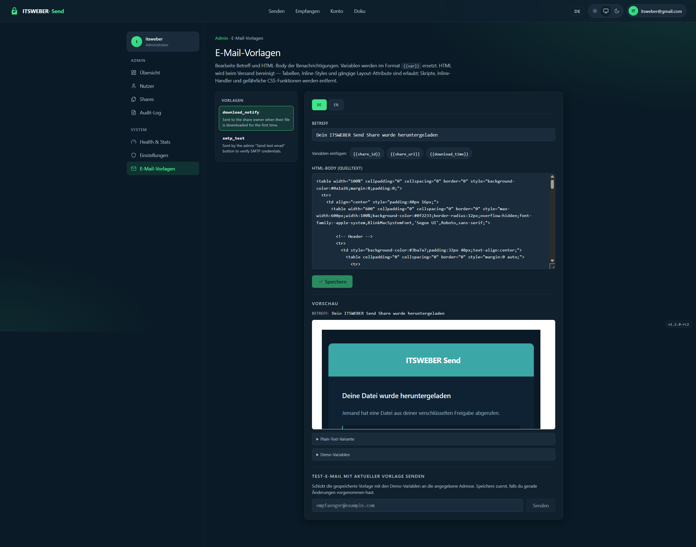

<!-- markdownlint-disable MD033 MD041 -->
<p align="center">
  <svg xmlns="http://www.w3.org/2000/svg" width="96" height="96" viewBox="0 0 120 120" fill="#3ba7a7" aria-hidden="true">
    <mask id="m"><rect width="120" height="120" fill="#fff"/><path d="M 38 72 L 86 50 L 60 86 L 60 72 Z" fill="#000"/><path d="M 38 72 L 60 72 L 60 86 Z" fill="#000"/></mask>
    <path d="M 42 50 L 42 38 a 18 18 0 0 1 36 0 L 78 50" fill="none" stroke="#3ba7a7" stroke-width="9" stroke-linecap="round" stroke-linejoin="round"/>
    <rect x="26" y="50" width="68" height="56" rx="11" fill="#3ba7a7" mask="url(#m)"/>
  </svg>
</p>

<h1 align="center">ITSWEBER Send</h1>

<p align="center">
  <strong>Selbst gehostetes, Ende-zu-Ende-verschlüsseltes Filesharing in einem einzigen Docker-Container.</strong>
</p>

<p align="center">
  <a href="LICENSE"></a>
  <a href="#schnellstart"></a>
  <a href="https://itsweber.de"></a>
</p>

<p align="center">
  <a href="#funktionen">Funktionen</a> ·
  <a href="#schnellstart">Schnellstart</a> ·
  <a href="#konfiguration">Konfiguration</a> ·
  <a href="docs/SECURITY.md">Sicherheit</a> ·
  <a href="docs/API.md">API</a> ·
  <a href="LICENSE">Lizenz</a>
</p>

<p align="center">
  🇬🇧 <strong>Read in English</strong> → <a href="README.md">README.md</a>
</p>

---

> **Status:** v1.3.5 — Drei Deployment-Modi (LAN direkt mit Self-Signed TLS, hinter bestehendem Reverse-Proxy, public mit gebündeltem Caddy + Let's Encrypt), Unraid-Template bereit für Community Apps Submission, mobile-responsive UI mit Hamburger-Drawer für Konto / Admin, QR-Code im 2FA-Setup, unterbrechbare chunked Uploads für Dateien beliebiger Größe, FSA-Streaming-Downloads, SMTP-Benachrichtigungen. Alle v1.0+-Shares bleiben entschlüsselbar. Container-Image aktuell nur `linux/amd64`; arm64 kommt zurück, sobald GitHub native arm64-Runner bereitstellt.

---

## Screenshots

<details open>
<summary><strong>Upload</strong></summary>


_Drag & Drop Multi-Datei-Upload mit Ablaufdatum, Download-Limit, Passwortschutz, 4-Wort-Code und Benachrichtigungseinstellungen._


_Alle Share-Optionen ausgefüllt: Passwort, Markdown-Notiz für den Empfänger, Benachrichtigung beim ersten Download._

</details>

<details>
<summary><strong>Share erstellt</strong></summary>


_Bereit zum Teilen: sprechbarer 4-Wort-Code, scannbarer QR-Code und der vollständige verschlüsselte Link — alles clientseitig generiert._

</details>

<details>
<summary><strong>Empfangen & Herunterladen</strong></summary>


_Empfänger geben den Share-Link, die 24-stellige ID oder den 4-Wort-Code ein, um einen Share abzurufen._


_Dateien werden mit Typ und Größe aufgelistet. Einzeln herunterladen oder alle als Streaming-ZIP. Der Server sieht nur Chiffriertexte._

</details>

<details>
<summary><strong>Admin-Panel</strong></summary>


_Systemübersicht: registrierte Nutzer, aktive und gesamte Shares, belegter Speicher. Links zu Health-, Readiness- und OpenAPI-Endpunkten._


_Benachrichtigungs-E-Mails bei erstem Download anpassen: vollständiger HTML-Template-Editor mit Live-Vorschau._

</details>

---

## Was ist ITSWEBER Send?

ITSWEBER Send ist ein moderner, schlanker Filesharing-Dienst, den du selbst betreibst. Dateien werden im Browser verschlüsselt (AES-256-GCM, Schlüssel im URL-Fragment), bevor sie den Server erreichen — der Server sieht ausschließlich Chiffriertext. Lade eine oder mehrere Dateien hoch, erhalte einen Link plus optionalen QR-Code oder vierstelligen Weitergabe-Code und teile ihn. Nach der konfigurierten Anzahl von Downloads oder nach Ablauf wird der Share dauerhaft gelöscht.

Inspiriert von Firefox Send und dem [timvisee/send](https://github.com/timvisee/send)-Fork, aber von Grund auf neu mit modernem Stack und erweitertem Funktionsumfang entwickelt.

## Funktionen

### Teilen

- Drag & Drop Multi-Datei-Upload mit unterbrechbaren, chunked Uploads — Dateien beliebiger Größe werden in 16-MiB-Chiffriertext-Chunks gestreamt, mit Pause/Fortsetzen aus der UI
- Share-Passwort (schichtweise über dem URL-Schlüssel — wenn gesetzt, wird der Share nur über das Passwort entschlüsselt, kein Master-Key im Link)
- Konfigurierbares Ablaufdatum (1 Std. / 24 Std. / 7 Tage / 30 Tage) und Download-Limit (1× bis unbegrenzt)
- QR-Code clientseitig für den Share-Link generiert
- 4-Wort-Weitergabe-Code als Alternative zur langen URL — kombiniert mit Passwort vollständig per Sprache übertragbar
- Optionale Markdown-Notiz für den Empfänger

### Privatsphäre & Sicherheit

- Clientseitige AES-256-GCM-Verschlüsselung — der Server empfängt weder Klartext noch Dateinamen
- Argon2id-Passwort-Hashing (OWASP 2026 Defaults) für Benutzerkonten
- Strenge CSP, COOP/COEP, HSTS, Permissions-Policy — keine Drittanbieter-Anfragen
- Rate-Limiting und progressiver Backoff gegen Brute-Force-Angriffe
- Container läuft als Nicht-Root mit read-only Root-Filesystem und abgelegten Capabilities
- Keine Telemetrie, keine Tracker, kein Phone-Home

### UX

- Hell-, Dunkel- und System-Themes
- Deutsche und englische UI (i18n-fähig)
- Als PWA installierbar
- Standardmäßig anonym; optionales Konto fügt Upload-Verlauf, höheres Quota und API-Token-Verwaltung hinzu

### Betrieb

- Einzelner Container, keine externe Datenbank oder Cache-Service erforderlich
- SQLite standardmäßig
- Health- und Readiness-Endpunkte für Container-Orchestratoren
- Webhooks für Upload- und Download-Events
- S3 / MinIO-Storage-Backend
- SMTP-Benachrichtigungen beim ersten Download

---

## Schnellstart

Das Image bringt drei Deployment-Modi mit. Wähle den, der zu deinem Setup passt.

### Modus 1 — LAN direkt (eingebetteter Caddy, Self-Signed TLS)

Für ein Homelab mit statischer LAN-IP, ohne öffentliche Domain. Der mitgelieferte
Caddy terminiert HTTPS auf Port 8443 mit einem selbst signierten Zertifikat —
so funktioniert Web Crypto auch im LAN.

```bash
docker run -d \
  --name itsweber-send \
  -p 8443:8443 \
  -v send-data:/data \
  -e SEND_HOST=192.168.1.100 \
  -e ORIGIN=https://192.168.1.100:8443 \
  -e BASE_URL=https://192.168.1.100:8443 \
  ghcr.io/itsweber-official/itsweber-send:latest
```

`https://192.168.1.100:8443` öffnen und das Self-Signed-Zertifikat einmal akzeptieren.
Compose-Variante: [`docker/docker-compose.lan.yml`](docker/docker-compose.lan.yml).

### Modus 2 — Hinter deinem bestehenden Reverse-Proxy

Für Setups, in denen Nginx Proxy Manager, Traefik, ein Ingress-Controller oder
ein anderer Upstream-Proxy schon HTTPS mit echtem Zertifikat terminiert. Der
eingebettete Caddy wird deaktiviert — keine doppelte TLS-Termination.

```bash
docker run -d \
  --name itsweber-send \
  -p 3000:3000 \
  -v send-data:/data \
  -e REVERSE_PROXY_MODE=true \
  -e ORIGIN=https://send.example.com \
  -e BASE_URL=https://send.example.com \
  ghcr.io/itsweber-official/itsweber-send:latest
```

Im Reverse-Proxy auf Port `3000` per HTTP weiterleiten. Compose-Variante:
[`docker/docker-compose.proxy.yml`](docker/docker-compose.proxy.yml).
Konkrete Snippets für NPM, Traefik, Caddy und Nginx: [docs/REVERSE_PROXY.md](docs/REVERSE_PROXY.md).

### Modus 3 — Public mit gebündeltem Caddy und Let's Encrypt

Für Single-Server-Deployments mit freien Ports 80/443 und ohne anderen Proxy
davor. Ein separater Caddy-Container holt sich ein Let's Encrypt-Zertifikat
und proxiert auf den Send-Container.

```bash
curl -O https://raw.githubusercontent.com/ITSWEBER-OFFICIAL/itsweber-send/main/docker/docker-compose.yml
curl -O https://raw.githubusercontent.com/ITSWEBER-OFFICIAL/itsweber-send/main/docker/Caddyfile.example

# In Caddyfile.example send.example.com durch die eigene Domain ersetzen, dann:
ORIGIN=https://send.example.com docker compose up -d
```

### Unraid-One-Shot-Template

Lege das mitgelieferte XML-Template auf dem Unraid-USB ab, damit der Container
im _Docker → Container hinzufügen → Vorlage_-Dropdown mit vorausgefüllten Feldern
(Image, Volume, Env-Vars, Security-Flags) erscheint:

```bash
wget -O /boot/config/plugins/dockerMan/templates-user/itsweber-send.xml \
  https://raw.githubusercontent.com/ITSWEBER-OFFICIAL/itsweber-send/main/unraid/itsweber-send.xml
```

> **Vor dem ersten Start: Datenverzeichnis chownen.** Das Image läuft als
> Non-Root-User `10001:10001`. Der Host-Bind-Mount muss diesem UID gehören:
>
> ```bash
> mkdir -p /mnt/user/appdata/itsweber-send
> chown -R 10001:10001 /mnt/user/appdata/itsweber-send
> ```
>
> Ohne diesen Schritt kann SQLite die Datenbank nicht öffnen und der Container beendet sich beim Start.

> **Nach dem ersten erfolgreichen Apply: Source-Template löschen.** Unraid
> behält sowohl die per `wget` abgelegte Quell-XML _als auch_ eine `my-`
> prefixte Kopie des angewandten User-States. Beim späteren _Update_ /
> _Force Update_ kann Unraid auf die Quell-Datei zurückgreifen und deine
> Anpassungen (Netzwerk, IP, Public-Domain, Ports) überschreiben. Quell-
> Datei nach dem ersten Apply entfernen, damit Unraid bei künftigen
> Updates ausschließlich den User-State liest:
>
> ```bash
> rm /boot/config/plugins/dockerMan/templates-user/itsweber-send.xml
> ```
>
> Bei künftigen Releases den Zyklus wget + Apply + rm wiederholen. Dieser
> Workaround entfällt, sobald das Projekt regulär in den Community Apps
> Store eingereicht ist.

### Aus dem Quellcode starten

```bash
git clone https://github.com/ITSWEBER-OFFICIAL/itsweber-send
cd itsweber-send
pnpm install
pnpm dev
```

Web-UI: `http://localhost:5173` — API: `http://localhost:3000`

---

## Konfiguration

Die gesamte Konfiguration erfolgt über Umgebungsvariablen. Vollständige Referenz: [docs/CONFIG.md](docs/CONFIG.md).

| Variable               | Standard                | Zweck                                                                             |
| ---------------------- | ----------------------- | --------------------------------------------------------------------------------- |
| `REVERSE_PROXY_MODE`   | `false`                 | Bei `true`: eingebetteter Caddy aus, Node bindet `0.0.0.0:3000`                   |
| `ORIGIN`               | `http://localhost:3000` | Öffentlicher Origin für Share-Links und Cookie-Scope                              |
| `BASE_URL`             | `http://localhost:3000` | Öffentliche URL, unter der der Dienst erreichbar ist                              |
| `SEND_HOST`            | `192.168.0.10`          | LAN-IP / Hostname, der ins Self-Signed-Cert des eingebetteten Caddy gebrannt wird |
| `NODE_ENV`             | `development`           | Auf `production` setzen für Produktiv-Deployments                                 |
| `STORAGE_BACKEND`      | `filesystem`            | `filesystem` (Standard) oder `s3` für S3/MinIO                                    |
| `STORAGE_PATH`         | `./data/uploads`        | Upload-Verzeichnis für das Filesystem-Backend                                     |
| `DB_PATH`              | `./data/shares.db`      | SQLite-Datenbankpfad                                                              |
| `RATE_LIMIT_PER_MIN`   | `60`                    | Per-IP-Anfragelimit pro Minute                                                    |
| `ENABLE_ACCOUNTS`      | `true`                  | Optionale Benutzerkonten erlauben                                                 |
| `REGISTRATION_ENABLED` | `true`                  | Neue Registrierungen erlauben                                                     |
| `DEFAULT_QUOTA_BYTES`  | `5368709120`            | Pro-Nutzer-Quota (Standard: 5 GB)                                                 |

---

## Dokumentation

| Dokument                                                         | Beschreibung                                            |
| ---------------------------------------------------------------- | ------------------------------------------------------- |
| [docs/INSTALL.md](docs/INSTALL.md)                               | Installationsanleitung für Docker und aus dem Quellcode |
| [docs/REVERSE_PROXY.md](docs/REVERSE_PROXY.md)                   | Betrieb hinter NPM, Traefik, Caddy oder Nginx           |
| [docs/CONFIG.md](docs/CONFIG.md)                                 | Vollständige Umgebungsvariablen-Referenz                |
| [docs/API.md](docs/API.md)                                       | REST-API-Referenz                                       |
| [docs/SECURITY.md](docs/SECURITY.md)                             | Sicherheitsarchitektur und Bedrohungsmodell             |
| [docs/ARCHITECTURE.md](docs/ARCHITECTURE.md)                     | Systemdesign und Komponentenübersicht                   |
| [docs/TROUBLESHOOTING.md](docs/TROUBLESHOOTING.md)               | Bekannte Probleme und Build-/Runtime-Fallstricke        |
| [packages/crypto-spec/README.md](packages/crypto-spec/README.md) | Kryptografisches Formatdokument                         |
| [CHANGELOG.md](CHANGELOG.md)                                     | Versionshistorie                                        |

---

## Architektur

| Schicht   | Technologie                        | Hinweise                                                         |
| --------- | ---------------------------------- | ---------------------------------------------------------------- |
| Backend   | Fastify 5 auf Node.js 22           | Unterbrechbare chunked Uploads (eigenes Protokoll), S3-Multipart |
| Frontend  | SvelteKit 2 + Svelte 5 + Vite      | TailwindCSS v4, svelte-i18n                                      |
| Krypto    | Web Crypto API                     | AES-256-GCM, PBKDF2 200.000 Iterationen                          |
| DB        | better-sqlite3                     | Eingebettet; kein separater Dienst                               |
| Storage   | Filesystem (Standard) / S3 (MinIO) | Austauschbarer Adapter                                           |
| Container | node:22-alpine, Multi-Stage        | Nicht-Root UID 10001, read-only Rootfs                           |
| Proxy     | Caddy 2                            | Automatisches TLS, Security-Header                               |

Vollständige Dokumentation: [docs/ARCHITECTURE.md](docs/ARCHITECTURE.md).

---

## Lizenz

[AGPL-3.0-only](LICENSE). Wer eine modifizierte Version als Netzwerkdienst betreibt, muss den Quellcode der Änderungen den Nutzern dieses Dienstes zugänglich machen.

## Mitmachen

Pull Requests sind willkommen. Siehe [CONTRIBUTING.md](CONTRIBUTING.md) für das Entwicklungs-Setup und Konventionen. Für Sicherheitsprobleme den privaten Meldeprozess unter [`.github/SECURITY.md`](.github/SECURITY.md) nutzen.
